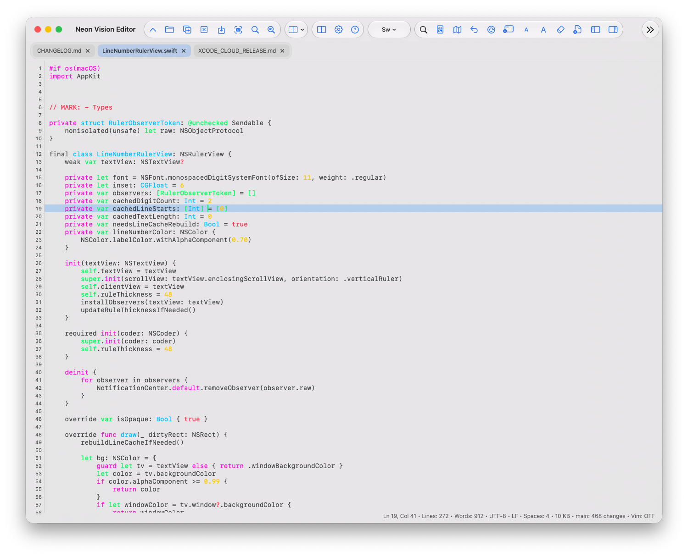
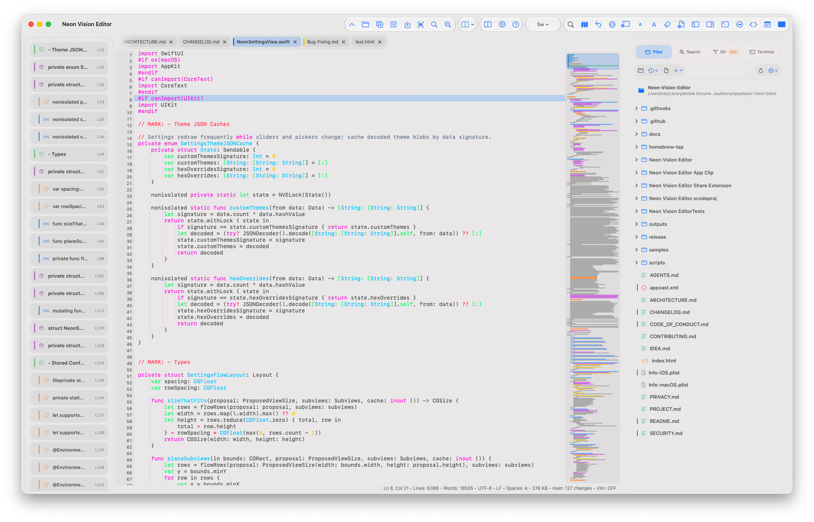
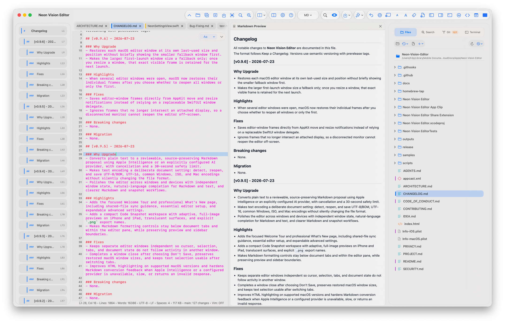

<h1 align="center">h3p</h1>

  Native Apple Platform Developer • Swift • Python • Editor Architecture

  
  
  
  

  Creator of Neon Vision Editor

# Hi, I’m h3p

I build native developer tools and focused software for the Apple ecosystem using Swift, Python, and modern Apple frameworks.

Creator of Neon Vision Editor — a lightweight, fully native code editor for macOS, iPadOS, and iOS.

I care about performance, readability, maintainable architecture, and software that feels native instead of bloated.

   

<h1 align="center">Neon Vision Editor</h1>

  Native. Fast. Readable.

  
  
  

# Neon Vision Editor

A lightweight, fully native code editor for macOS, iPadOS, and iOS.

Built with SwiftUI, AppKit, and UIKit.

## Philosophy

- Native-first architecture
- Fast startup and responsive editing
- Minimal and distraction-free interface
- Cross-platform consistency across Apple devices
- Optional AI assistance that responds only when requested

No Electron.  
No telemetry.  
No subscription maze.

# Features

### Focused editing

- Native tabbed editor with syntax highlighting for code, Markdown, HTML, JSON, YAML, XML, TeX, logs, and more
- Regex Find & Replace, Replace All, Quick Open (`⌘P`), starter templates, and lightweight Vim navigation
- Inline completion with Tab-to-accept, plus optional AI suggestions for code, Markdown, and prose
- Line numbers, line wrap, current-line and matching-bracket highlights, invisible-character markers, and pinch-to-zoom font sizing
- Code minimap with click-to-jump navigation and a draggable viewport marker
- Built-in themes and saved custom themes, including Dracula, One Dark Pro, Nord, Tokyo Night, Gruvbox, and Neon Glow

### Projects and files

- Recursive project sidebar with Files, Search, Git, and a macOS terminal
- Per-document cursor, selection, viewport, minimap, and tab-state restoration
- Multi-window support on macOS: independent tabs and editor state, with each window returning at its own last-used size and position
- Deliberate text-encoding support for UTF-8/BOM, UTF-16, common Windows, ISO, and Mac encodings
- Large-file safeguards: responsive modes for large files and a read-only partial preview for files at or above 100 MB

### Markdown, previews, and sharing

- Optional Markdown, HTML, and SVG previews with adaptive layouts across Mac, iPad, and iPhone
- Contextual Markdown formatting for headings, emphasis, links, lists, quotes, code, images, and tables
- Plain-text-to-Markdown proposals through Apple Intelligence or an explicitly configured AI provider, with cancellation and safety limits
- Code Snapshots: compose and export polished PNG images with selectable appearance, background, frame, layout, dimensions, padding, and line numbers

### Reliable workflows and privacy

- Event-driven external file refresh for iCloud Drive, network folders, and other file providers; unsaved work is protected with Keep Local, Reload, and Compare choices
- Session restore, Save As, diffs, structured CSV/TSV and plist views, plus Apple crash-report and log inspection
- API keys stay in Keychain; AI and remote workflows are opt-in; no telemetry, subscriptions, or paywalls

# Platforms

- macOS
- iPadOS
- iOS
- visionOS

Designed to provide a consistent editing experience across Apple platforms with native UI and behavior.

## Screenshots

  

  

  

# Links

## Neon Vision Editor

- 

  <a href="https://github.com/h3pdesign/Neon-Vision-Editor">
  GitHub Repository
  </a>

- 

  <a href="https://apps.apple.com/de/app/neon-vision-editor/id6758950965">
  AppStore 
  </a>

# Current Focus

- Editor architecture
- Large-file performance
- Cross-device workflows
- Native Apple platform development
- SwiftUI/AppKit/UIKit
- Python tooling and automation
- CI/CD pipelines
- Automated release workflows
- Data visualization and monitoring systems

# Selected Projects

## Neon Vision Editor
Native code editor for macOS, iPadOS, and iOS.

## appsh3p
Public dashboards, monitoring systems, and visualization projects.

## homebrew-tap
Automated Homebrew distribution for notarized macOS releases.

# Development Philosophy

I prefer focused software over feature overload.

Software should feel sharp, calm, and reliable.

I value:
- native performance
- maintainable architecture
- readable interfaces
- low-friction workflows
- long-term usability

# Technologies

Swift • SwiftUI • AppKit • UIKit • Python • SQLite • GitHub Actions • Azure

# Activity

- Continuous public releases
- Open-source development
- Automated release pipelines
- Native Apple platform tooling
- UI/UX focused engineering

# Pinned Repositories

## Neon Vision Editor
Native editor for Apple platforms.

## appsh3p
Visualization dashboards and monitoring systems.

## homebrew-tap
Homebrew cask automation and distribution.

# Links

- Portfolio  
  https://h3p.me

- GitHub  
  https://github.com/h3pdesign

  Built with Swift and native Apple frameworks.

